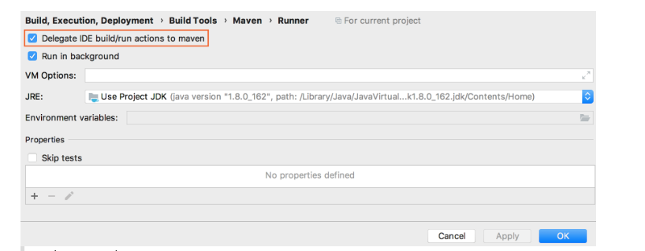
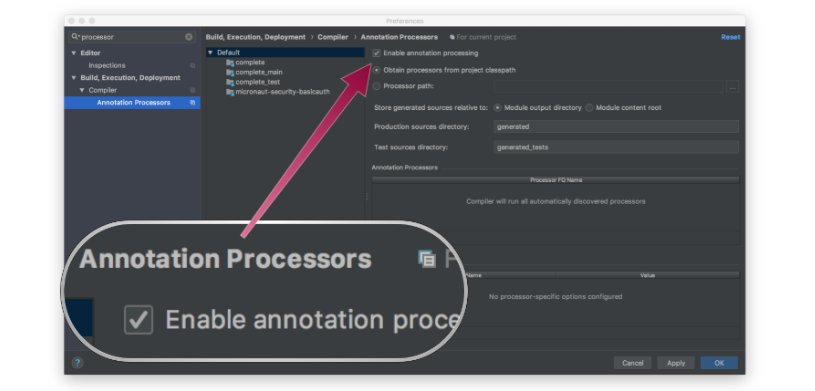

# Management

> Desde o Micronaut Framework 4.0, para usar a configuração YAML, você precisa adicionar a [dependência YAML](https://micronaut.io/2023/02/19/micronaut-framework-4-0-and-snakeyaml-transitive-dependency/) .


``` xml
<dependency>
    <groupId>io.micronaut</groupId>
    <artifactId>micronaut-management</artifactId>
    <scope>compile</scope>
</dependency>

```

``` yml
endpoints:
  info:
    enabled: true
    sensitive: false
```


``` xml
<properties>
   ...
   <gitCommitIdPlugin.version>4.0.5</gitCommitIdPlugin.version>
</properties>

...

<plugin>
    <groupId>pl.project13.maven</groupId>
    <artifactId>git-commit-id-plugin</artifactId>
    <version>${gitCommitIdPlugin.version}</version>
    <executions>
        <execution>
            <id>get-the-git-infos</id>
            <goals>
                <goal>revision</goal>
            </goals>
            <phase>compile</phase>
        </execution>
    </executions>
    <configuration>
        <generateGitPropertiesFile>true</generateGitPropertiesFile>
    </configuration>
</plugin>
```

## Teste

``` json
{
  "git": {
    "dirty": "true",
    "commit": {
      "id": "7368906193527fbf2b45f1ed5b08c56631f5b155",
      "describe": "7368906-dirty",
      "time": "1527429126",
      "message": {
        "short": "Initial version",
        "full": "Initial version"
      },
      "user": {
        "name": "sdelamo",
        "email": "sergio.delamo@softamo.com"
      }
    },
    "branch": "master"
  }
}
```

``` java

package example.micronaut;

import io.micronaut.http.HttpRequest;
import io.micronaut.http.HttpResponse;
import io.micronaut.http.client.HttpClient;
import io.micronaut.http.client.annotation.Client;
import io.micronaut.test.extensions.junit5.annotation.MicronautTest;
import org.junit.jupiter.api.Test;

import jakarta.inject.Inject;
import java.util.Map;

import static org.junit.jupiter.api.Assertions.assertEquals;
import static org.junit.jupiter.api.Assertions.assertNotNull;

@MicronautTest
public class InfoTest {

    @Inject
    @Client("/")
    HttpClient client;

    @Test
    public void testGitComitInfoAppearsInJson() {
        HttpRequest request = HttpRequest.GET("/info");

        HttpResponse<Map> rsp = client.toBlocking().exchange(request, Map.class);

        assertEquals(200, rsp.status().getCode());

        Map json = rsp.body();

        assertNotNull(json.get("git"));
        assertNotNull(((Map) json.get("git")).get("commit"));
        assertNotNull(((Map) ((Map) json.get("git")).get("commit")).get("message"));
        assertNotNull(((Map) ((Map) json.get("git")).get("commit")).get("time"));
        assertNotNull(((Map) ((Map) json.get("git")).get("commit")).get("id"));
        assertNotNull(((Map) ((Map) json.get("git")).get("commit")).get("user"));
        assertNotNull(((Map) json.get("git")).get("branch"));
    }
}
```

# [Using Intellij Idea to develop Mironaut Aplications](https://guides.micronaut.io/latest/micronaut-intellij-idea-ide-setup-maven-java.html)

- Delegar ações de construção e execução ao Maven


# Habilitar processamento de anotações


