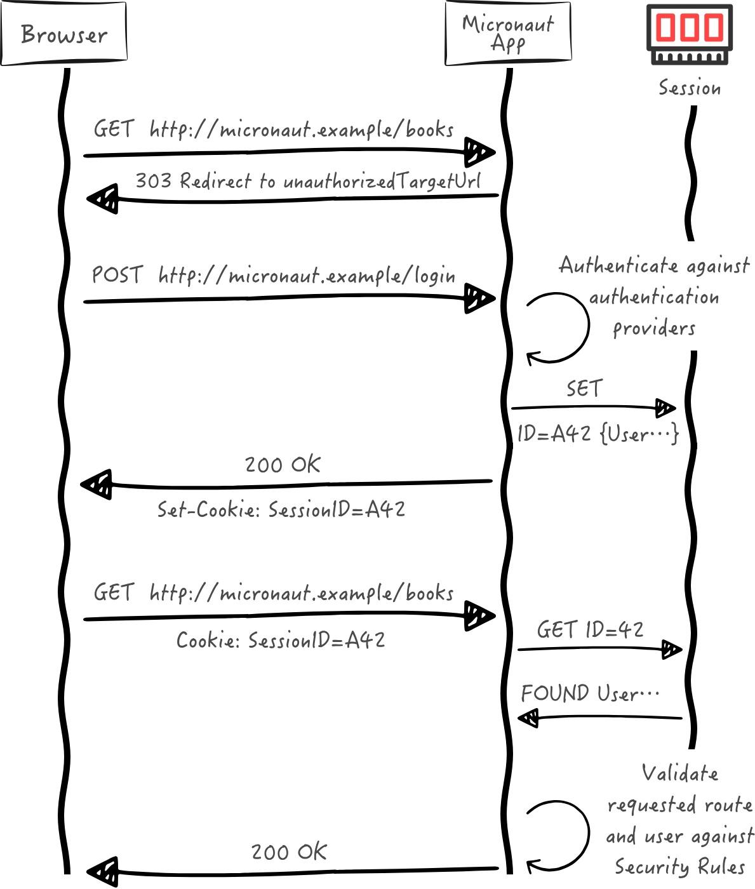
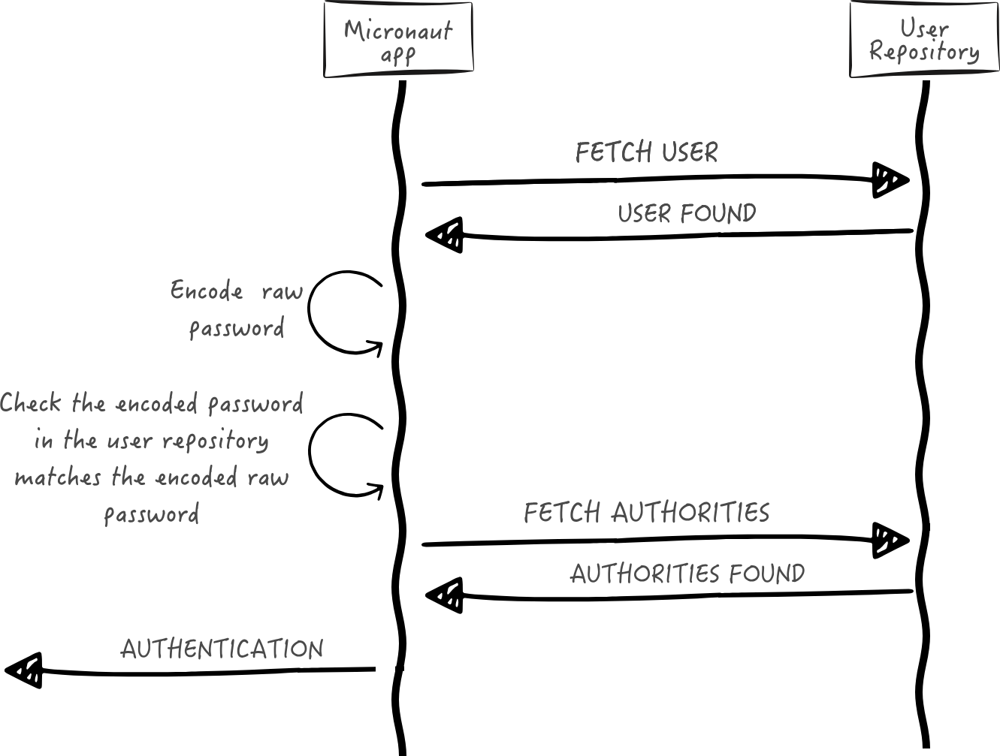

# Database authentication



``` bash
mn create-app example.micronaut.micronautguide \
    --features=data-jdbc,flyway,postgres,views-thymeleaf,validation,security-session,reactor \
    --build=maven \
    --lang=java \
    --test=junit
```


## Acess fo database

``` xml
<!-- Add the following to your annotationProcessorPaths element -->
<path>
    <groupId>io.micronaut.data</groupId>
    <artifactId>micronaut-data-processor</artifactId>
</path>
<dependency>
    <groupId>io.micronaut.data</groupId>
    <artifactId>micronaut-data-jdbc</artifactId>
    <scope>compile</scope>
</dependency>
<dependency>
    <groupId>io.micronaut.sql</groupId>
    <artifactId>micronaut-jdbc-hikari</artifactId>
    <scope>compile</scope>
</dependency>
<dependency>
    <groupId>org.postgresql</groupId>
    <artifactId>postgresql</artifactId>
    <scope>runtime</scope>
</dependency>
```


``` properties
datasources.default.db-type=postgres
datasources.default.dialect=POSTGRES
datasources.default.schema-generate=NONE
datasources.default.driver-class-name=org.postgresql.Driver
```


``` xml
<dependency>
    <groupId>io.micronaut.flyway</groupId>
    <artifactId>micronaut-flyway</artifactId>
    <scope>compile</scope>
</dependency>
```

``` properties
flyway.datasources.default.enabled=true
```

`src/main/resources/db/migration/V1__schema.sql`

``` java
CREATE TABLE role (
    id BIGSERIAL PRIMARY KEY NOT NULL,
    authority varchar(255) NOT NULL
);
CREATE TABLE "user" (
    id BIGSERIAL primary key NOT NULL,
    username varchar(255) NOT NULL,
    password varchar(255) NOT NULL,
    enabled BOOLEAN NOT NULL,
    account_expired BOOLEAN NOT NULL,
    account_locked BOOLEAN NOT NULL,
    password_expired BOOLEAN NOT NULL
);
CREATE TABLE user_role(
    id_role_id BIGINT NOT NULL,
    id_user_id BIGINT NOT NULL,
    FOREIGN KEY (id_role_id) REFERENCES role(id),
    FOREIGN KEY (id_user_id) REFERENCES "user"(id),
    PRIMARY KEY (id_role_id, id_user_id)
);
```

## Security session
``` xml
<dependency>
    <groupId>io.micronaut.security</groupId>
    <artifactId>micronaut-security-session</artifactId>
    <scope>compile</scope>
</dependency>
```

## Security Configuration

``` properties

micronaut.security.authentication=session

micronaut.security.redirect.login-success=/

micronaut.security.redirect.login-failure=/user/authFailed
```

## Validation

``` xml
<dependency>
    <groupId>io.micronaut.validation</groupId>
    <artifactId>micronaut-validation</artifactId>
    <scope>compile</scope>
</dependency>
<!-- Add the following to your annotationProcessorPaths element -->
<path>
    <groupId>io.micronaut.validation</groupId>
    <artifactId>micronaut-validation-processor</artifactId>
</path>
```

## Reactor

``` xml
<dependency>
    <groupId>io.micronaut.reactor</groupId>
    <artifactId>micronaut-reactor</artifactId>
    <scope>compile</scope>
</dependency>

```


## Entidades

### Role

``` java
package example.micronaut.entities;

import io.micronaut.core.annotation.Nullable;
import io.micronaut.data.annotation.GeneratedValue;
import io.micronaut.data.annotation.Id;
import io.micronaut.data.annotation.MappedEntity;
import jakarta.validation.constraints.NotBlank;

@MappedEntity
public record Role(@Nullable
                   @Id
                   @GeneratedValue
                   Long id,
                   @NotBlank
                   String authority) {
}
```


### User

``` java

package example.micronaut;

public interface UserState {
    String getUsername();

    String getPassword();

    boolean isEnabled();

    boolean isAccountExpired();

    boolean isAccountLocked();

    boolean isPasswordExpired();
}

```


``` java
package example.micronaut.entities;

import example.micronaut.UserState;
import io.micronaut.core.annotation.Nullable;
import io.micronaut.data.annotation.GeneratedValue;
import io.micronaut.data.annotation.Id;
import io.micronaut.data.annotation.MappedEntity;
import jakarta.validation.constraints.NotBlank;

@MappedEntity
public record User(@Nullable
                   @Id
                   @GeneratedValue
                   Long id,
                   @NotBlank
                   String username,
                   @NotBlank
                   String password,
                   boolean enabled,
                   boolean accountExpired,
                   boolean accountLocked,
                   boolean passwordExpired) implements UserState {

    @Override
    public String getUsername() {
        return username;
    }

    @Override
    public String getPassword() {
        return password;
    }

    @Override
    public boolean isEnabled() {
        return enabled;
    }

    @Override
    public boolean isAccountExpired() {
        return accountExpired;
    }

    @Override
    public boolean isAccountLocked() {
        return accountLocked;
    }

    @Override
    public boolean isPasswordExpired() {
        return false;
    }
}
```

### User Role

``` java

package example.micronaut.entities;

import io.micronaut.data.annotation.Embeddable;
import io.micronaut.data.annotation.Relation;

import java.util.Objects;

@Embeddable
public class UserRoleId {

    @Relation(value = Relation.Kind.MANY_TO_ONE)
    private final User user;

    @Relation(value = Relation.Kind.MANY_TO_ONE)
    private final Role role;

    public UserRoleId(User user, Role role) {
        this.user = user;
        this.role = role;
    }

    @Override
    public boolean equals(Object o) {
        if (this == o) {
            return true;
        }
        if (o == null || getClass() != o.getClass()) {
            return false;
        }
        UserRoleId userRoleId = (UserRoleId) o;
        return role.id().equals(userRoleId.getRole().id()) &&
                user.id().equals(userRoleId.getUser().id());
    }

    @Override
    public int hashCode() {
        return Objects.hash(role.id(), user.id());
    }

    public User getUser() {
        return user;
    }

    public Role getRole() {
        return role;
    }
}
```


``` java

package example.micronaut.entities;

import io.micronaut.data.annotation.EmbeddedId;
import io.micronaut.data.annotation.MappedEntity;

@MappedEntity
public class UserRole {

    @EmbeddedId
    private final UserRoleId id;

    public UserRole(UserRoleId id) {
        this.id = id;
    }

    public UserRoleId getId() {
        return id;
    }
}
```

Ele utilizar o @EmbeddedId para mapear a chave primária composta.


## Repository

``` java

package example.micronaut.repositories;

import example.micronaut.entities.Role;
import io.micronaut.data.jdbc.annotation.JdbcRepository;
import io.micronaut.data.model.query.builder.sql.Dialect;
import io.micronaut.data.repository.CrudRepository;
import java.util.Optional;

@JdbcRepository(dialect = Dialect.POSTGRES)
public interface RoleJdbcRepository extends CrudRepository<Role, Long> {

    Role save(String authority);

    Optional<Role> findByAuthority(String authority);
}

```

``` java
package example.micronaut.repositories;

import example.micronaut.entities.User;
import io.micronaut.core.annotation.NonNull;
import io.micronaut.data.jdbc.annotation.JdbcRepository;
import io.micronaut.data.model.query.builder.sql.Dialect;
import io.micronaut.data.repository.CrudRepository;
import jakarta.validation.constraints.NotBlank;

import java.util.Optional;

@JdbcRepository(dialect = Dialect.POSTGRES)
public interface UserJdbcRepository extends CrudRepository<User, Long> {

    Optional<User> findByUsername(@NonNull @NotBlank String username);
}
```

``` java
package example.micronaut.repositories;

import example.micronaut.entities.UserRole;
import example.micronaut.entities.UserRoleId;
import io.micronaut.data.annotation.Query;
import io.micronaut.data.jdbc.annotation.JdbcRepository;
import io.micronaut.data.model.query.builder.sql.Dialect;
import io.micronaut.data.repository.CrudRepository;
import jakarta.validation.constraints.NotBlank;

import java.util.List;

@JdbcRepository(dialect = Dialect.POSTGRES)
public interface UserRoleJdbcRepository extends CrudRepository<UserRole, UserRoleId> {

    @Query("""
    SELECT authority FROM role
    INNER JOIN user_role ON user_role.id_role_id = role.id
    INNER JOIN "user" user_ ON user_role.id_user_id = user_.id
    WHERE user_.username = :username""")
    List<String> findAllAuthoritiesByUsername(@NotBlank String username);
}
```


## Password Encoder

``` java

package example.micronaut;

import jakarta.validation.constraints.NotBlank;

public interface PasswordEncoder {

    String encode(@NotBlank String rawPassword);

    boolean matches(@NotBlank String rawPassword,
                    @NotBlank String encodedPassword);
}

```


``` xml
<dependency>
    <groupId>org.springframework.security</groupId>
    <artifactId>spring-security-crypto</artifactId>
    <version>6.2.0</version>
    <scope>compile</scope>
</dependency>
<dependency>
    <groupId>org.slf4j</groupId>
    <artifactId>jcl-over-slf4j</artifactId>
    <scope>compile</scope>
</dependency>
```

``` java
package example.micronaut;

import io.micronaut.core.annotation.NonNull;
import org.springframework.security.crypto.bcrypt.BCryptPasswordEncoder;
import jakarta.inject.Singleton;
import jakarta.validation.constraints.NotBlank;

@Singleton
class BCryptPasswordEncoderService implements PasswordEncoder {

    org.springframework.security.crypto.password.PasswordEncoder delegate = new BCryptPasswordEncoder();

    public String encode(@NotBlank @NonNull String rawPassword) {
        return delegate.encode(rawPassword);
    }

    @Override
    public boolean matches(@NotBlank @NonNull String rawPassword,
                           @NotBlank @NonNull String encodedPassword) {
        return delegate.matches(rawPassword, encodedPassword);
    }
}
```

### Register service


``` java
package example.micronaut;

import example.micronaut.entities.Role;
import example.micronaut.entities.User;
import example.micronaut.entities.UserRole;
import example.micronaut.entities.UserRoleId;
import example.micronaut.exceptions.UserAlreadyExistsException;
import example.micronaut.repositories.RoleJdbcRepository;
import example.micronaut.repositories.UserJdbcRepository;
import example.micronaut.repositories.UserRoleJdbcRepository;
import io.micronaut.core.annotation.Nullable;
import jakarta.inject.Singleton;
import jakarta.transaction.Transactional;
import jakarta.validation.constraints.NotBlank;
import java.util.Collections;
import java.util.List;
import java.util.Optional;

@Singleton
public class RegisterService {

    private static final boolean DEFAULT_ENABLED = true;
    private static final boolean DEFAULT_ACCOUNT_EXPIRED = false;

    private static final boolean DEFAULT_ACCOUNT_LOCKED = false;

    private static final boolean DEFAULT_PASSWORD_EXPIRED = false;
    private final RoleJdbcRepository roleService;
    private final UserJdbcRepository userJdbcRepository;
    private final UserRoleJdbcRepository userRoleJdbcRepository;
    private final PasswordEncoder passwordEncoder;

    public RegisterService(RoleJdbcRepository roleGormService,
                    UserJdbcRepository userJdbcRepository,
                    PasswordEncoder passwordEncoder,
                    UserRoleJdbcRepository userRoleJdbcRepository) {
        this.roleService = roleGormService;
        this.userJdbcRepository = userJdbcRepository;
        this.userRoleJdbcRepository = userRoleJdbcRepository;
        this.passwordEncoder = passwordEncoder;
    }

    public void register(@NotBlank String username,
                         @NotBlank String rawPassword) {
        register(username, rawPassword, Collections.emptyList());
    }

    @Transactional
    public void register(@NotBlank String username,
                         @NotBlank String rawPassword,
                         @Nullable List<String> authorities) {
        Optional<User> userOptional = userJdbcRepository.findByUsername(username);
        if (userOptional.isPresent()) {
            throw new UserAlreadyExistsException();
        }
        User user = userJdbcRepository.save(createUser(username, rawPassword));
        if (user != null && authorities != null) {
            for (String authority : authorities) {
                Role role = roleService.findByAuthority(authority).orElseGet(() -> roleService.save(authority));
                UserRoleId userRoleId = new UserRoleId(user, role);
                if (userRoleJdbcRepository.findById(userRoleId).isEmpty()) {
                    userRoleJdbcRepository.save(new UserRole(userRoleId));
                }
            }
        }
    }

    private User createUser(String username, String rawPassword) {
        final String encodedPassword = passwordEncoder.encode(rawPassword);
        return new User(null,
                username,
                encodedPassword,
                DEFAULT_ENABLED,
                DEFAULT_ACCOUNT_EXPIRED,
                DEFAULT_ACCOUNT_LOCKED,
                DEFAULT_PASSWORD_EXPIRED);
    }
}
```

``` java
package example.micronaut.exceptions;

public class UserAlreadyExistsException extends RuntimeException {
}
```

## Delegatin Authentication Provider




## User fetcher


``` java

package example.micronaut;

import io.micronaut.core.annotation.NonNull;
import jakarta.validation.constraints.NotBlank;

import java.util.Optional;

interface UserFetcher {

    Optional<UserState> findByUsername(@NotBlank @NonNull String username);
}

```


``` java
package example.micronaut;

import example.micronaut.repositories.UserJdbcRepository;
import io.micronaut.core.annotation.NonNull;
import jakarta.inject.Singleton;
import jakarta.validation.constraints.NotBlank;

import java.util.Optional;

@Singleton
class UserFetcherService implements UserFetcher {

    private final UserJdbcRepository userJdbcRepository;

    UserFetcherService(UserJdbcRepository userJdbcRepository) {
        this.userJdbcRepository = userJdbcRepository;
    }

    @Override
    public Optional<UserState> findByUsername(@NotBlank @NonNull String username) {
        return userJdbcRepository.findByUsername(username).map(UserState.class::cast);
    }
}
```


``` java

package example.micronaut;

import java.util.List;

public interface AuthoritiesFetcher {

    List<String> findAuthoritiesByUsername(String username);
}

```

``` java
package example.micronaut;

import example.micronaut.repositories.UserRoleJdbcRepository;
import jakarta.inject.Singleton;

import java.util.List;

@Singleton
class AuthoritiesFetcherService implements AuthoritiesFetcher {

    private final UserRoleJdbcRepository userRoleJdbcRepository;

    AuthoritiesFetcherService(UserRoleJdbcRepository userRoleJdbcRepository) {
        this.userRoleJdbcRepository = userRoleJdbcRepository;
    }

    @Override
    public List<String> findAuthoritiesByUsername(String username) {
        return userRoleJdbcRepository.findAllAuthoritiesByUsername(username);
    }
}

```

## Authentication provider

``` java

package example.micronaut;

import io.micronaut.core.annotation.NonNull;
import io.micronaut.core.annotation.Nullable;
import io.micronaut.http.HttpRequest;
import io.micronaut.scheduling.TaskExecutors;
import io.micronaut.security.authentication.AuthenticationException;
import io.micronaut.security.authentication.AuthenticationFailed;
import io.micronaut.security.authentication.AuthenticationRequest;
import io.micronaut.security.authentication.AuthenticationResponse;
import io.micronaut.security.authentication.provider.HttpRequestReactiveAuthenticationProvider;
import reactor.core.publisher.FluxSink;
import reactor.core.publisher.Flux;
import reactor.core.scheduler.Scheduler;
import reactor.core.scheduler.Schedulers;
import org.reactivestreams.Publisher;
import jakarta.inject.Named;
import jakarta.inject.Singleton;

import java.util.List;
import java.util.concurrent.ExecutorService;

import static io.micronaut.security.authentication.AuthenticationFailureReason.ACCOUNT_EXPIRED;
import static io.micronaut.security.authentication.AuthenticationFailureReason.ACCOUNT_LOCKED;
import static io.micronaut.security.authentication.AuthenticationFailureReason.CREDENTIALS_DO_NOT_MATCH;
import static io.micronaut.security.authentication.AuthenticationFailureReason.PASSWORD_EXPIRED;
import static io.micronaut.security.authentication.AuthenticationFailureReason.USER_DISABLED;
import static io.micronaut.security.authentication.AuthenticationFailureReason.USER_NOT_FOUND;

@Singleton
class DelegatingAuthenticationProvider<B> implements HttpRequestReactiveAuthenticationProvider<B> {

    private final UserFetcher userFetcher;
    private final PasswordEncoder passwordEncoder;
    private final AuthoritiesFetcher authoritiesFetcher;
    private final Scheduler scheduler;

    DelegatingAuthenticationProvider(UserFetcher userFetcher,
                                     PasswordEncoder passwordEncoder,
                                     AuthoritiesFetcher authoritiesFetcher,
                                     @Named(TaskExecutors.BLOCKING) ExecutorService executorService) {
        this.userFetcher = userFetcher;
        this.passwordEncoder = passwordEncoder;
        this.authoritiesFetcher = authoritiesFetcher;
        this.scheduler = Schedulers.fromExecutorService(executorService);
    }

    @Override
    @NonNull
    public  Publisher<AuthenticationResponse> authenticate(
            @Nullable HttpRequest<B> requestContext,
            @NonNull AuthenticationRequest<String, String> authenticationRequest
    ) {
        return Flux.<AuthenticationResponse>create(emitter -> {
            UserState user = fetchUserState(authenticationRequest);
            AuthenticationFailed authenticationFailed = validate(user, authenticationRequest);
            if (authenticationFailed != null) {
                emitter.error(new AuthenticationException(authenticationFailed));
            } else {
                emitter.next(createSuccessfulAuthenticationResponse(user));
                emitter.complete();
            }
        }, FluxSink.OverflowStrategy.ERROR).subscribeOn(scheduler);
    }

    private AuthenticationFailed validate(UserState user, AuthenticationRequest<?, ?> authenticationRequest) {
        AuthenticationFailed authenticationFailed = null;
        if (user == null) {
            authenticationFailed = new AuthenticationFailed(USER_NOT_FOUND);

        } else if (!user.isEnabled()) {
            authenticationFailed = new AuthenticationFailed(USER_DISABLED);

        } else if (user.isAccountExpired()) {
            authenticationFailed = new AuthenticationFailed(ACCOUNT_EXPIRED);

        } else if (user.isAccountLocked()) {
            authenticationFailed = new AuthenticationFailed(ACCOUNT_LOCKED);

        } else if (user.isPasswordExpired()) {
            authenticationFailed = new AuthenticationFailed(PASSWORD_EXPIRED);

        } else if (!passwordEncoder.matches(authenticationRequest.getSecret().toString(), user.getPassword())) {
            authenticationFailed = new AuthenticationFailed(CREDENTIALS_DO_NOT_MATCH);
        }

        return authenticationFailed;
    }

    private UserState fetchUserState(AuthenticationRequest<?, ?> authRequest) {
        final Object username = authRequest.getIdentity();
        return userFetcher.findByUsername(username.toString()).orElse(null);
    }

    private AuthenticationResponse createSuccessfulAuthenticationResponse(UserState user) {
        List<String> authorities = authoritiesFetcher.findAuthoritiesByUsername(user.getUsername());
        return AuthenticationResponse.success(user.getUsername(), authorities);
    }
}
```

## Viwers

``` xml

<dependency>
    <groupId>io.micronaut.views</groupId>
    <artifactId>micronaut-views-thymeleaf</artifactId>
    <scope>compile</scope>
</dependency>

```

``` xml

<dependency>
    <groupId>io.micronaut.views</groupId>
    <artifactId>micronaut-views-fieldset</artifactId>
    <scope>compile</scope>
</dependency>

```

o código abaixo está mais relacionado com o themeleaf

``` java

package example.micronaut;

import io.micronaut.core.annotation.NonNull;
import io.micronaut.http.HttpRequest;
import io.micronaut.security.endpoints.LogoutControllerConfiguration;
import io.micronaut.security.utils.SecurityService;
import io.micronaut.views.ModelAndView;
import io.micronaut.views.fields.Fieldset;
import io.micronaut.views.fields.Form;
import io.micronaut.views.fields.FormGenerator;
import io.micronaut.views.fields.elements.InputSubmitFormElement;
import io.micronaut.views.fields.messages.Message;
import io.micronaut.views.model.ViewModelProcessor;
import jakarta.inject.Singleton;

import java.util.Collections;
import java.util.HashMap;
import java.util.Map;

@Singleton
class LogoutFormViewModelProcessor  implements ViewModelProcessor<Map<String, Object>> {

    private static final String MODEL_KEY = "logoutForm";

    private final SecurityService securityService;
    private final Form logoutForm;

    LogoutFormViewModelProcessor(FormGenerator formGenerator,
                                 SecurityService securityService,
                                 LogoutControllerConfiguration logoutControllerConfiguration) {
        this.securityService = securityService;
        this.logoutForm = formGenerator.generate(logoutControllerConfiguration.getPath(),
                new Fieldset(Collections.emptyList(), Collections.emptyList()), InputSubmitFormElement
                        .builder()
                        .value(Message.of("Logout", "logout.submit"))
                        .build());
    }

    @Override
    public void process(@NonNull HttpRequest<?> request, @NonNull ModelAndView<Map<String, Object>> modelAndView) {
        if (securityService.isAuthenticated()) {
            Map<String, Object> viewModel = modelAndView.getModel().orElseGet(() -> {
                final HashMap<String, Object> newModel = new HashMap<>(1);
                modelAndView.setModel(newModel);
                return newModel;
            });
            try {
                viewModel.putIfAbsent(MODEL_KEY, logoutForm);
            } catch (UnsupportedOperationException ex) {
                final HashMap<String, Object> modifiableModel = new HashMap<>(viewModel);
                modifiableModel.putIfAbsent(MODEL_KEY, logoutForm);
                modelAndView.setModel(modifiableModel);
            }
        }
    }
}
```


## Login forme

``` java

package example.micronaut.controllers;

import io.micronaut.serde.annotation.Serdeable;
import io.micronaut.views.fields.annotations.InputPassword;
import jakarta.validation.constraints.NotBlank;

@Serdeable
public record LoginForm(@NotBlank String username,
                        @InputPassword @NotBlank String password) {
}
```

``` java
package example.micronaut.controllers;

import example.micronaut.constraints.PasswordMatch;
import io.micronaut.serde.annotation.Serdeable;
import io.micronaut.views.fields.annotations.InputPassword;
import jakarta.validation.constraints.NotBlank;

@PasswordMatch
@Serdeable
public record SignUpForm(@NotBlank String username,
                         @InputPassword @NotBlank String password,
                         @InputPassword @NotBlank String repeatPassword) {
}
```


## Validação cutomizada @PasswordMatch

``` java
package example.micronaut.constraints;

import jakarta.validation.Constraint;
import jakarta.validation.Payload;

import java.lang.annotation.ElementType;
import java.lang.annotation.Retention;
import java.lang.annotation.RetentionPolicy;
import java.lang.annotation.Target;

@Constraint(validatedBy = PasswordMatchValidator.class)
@Target(ElementType.TYPE)
@Retention(RetentionPolicy.RUNTIME)
public @interface PasswordMatch {

    String MESSAGE = "example.micronaut.constraints.PasswordMatch.message";

    String message() default "{" + MESSAGE + "}";

    Class<?>[] groups() default {};

    Class<? extends Payload>[] payload() default {};
}
```

``` java

package example.micronaut.constraints;

import example.micronaut.controllers.SignUpForm;
import io.micronaut.core.annotation.Introspected;
import jakarta.validation.ConstraintValidator;
import jakarta.validation.ConstraintValidatorContext;

@Introspected
public class PasswordMatchValidator implements ConstraintValidator<PasswordMatch, SignUpForm> {

    @Override
    public boolean isValid(SignUpForm value, ConstraintValidatorContext context) {
        if (value.password() == null && value.repeatPassword() == null) {
            return true;
        }
        if (value.password() != null && value.repeatPassword() == null) {
            return false;
        }
        if (value.password() == null) {
            return false;
        }
        return value.password().equals(value.repeatPassword());
    }
}
```

``` java
package example.micronaut.constraints;

import io.micronaut.context.StaticMessageSource;
import jakarta.inject.Singleton;

@Singleton
public class PasswordMatchMessages extends StaticMessageSource {

    public static final String PASSWORD_MATCH_MESSAGE = "Passwords do not match";

    private static final String MESSAGE_SUFFIX = ".message";

    public PasswordMatchMessages() {
        addMessage(PasswordMatch.class.getName() + MESSAGE_SUFFIX, PASSWORD_MATCH_MESSAGE);
    }
}
```


## Controller

``` java
package example.micronaut.controllers;

import io.micronaut.http.MediaType;
import io.micronaut.http.annotation.Controller;
import io.micronaut.http.annotation.Get;
import io.micronaut.http.annotation.Produces;
import io.micronaut.security.annotation.Secured;
import io.micronaut.security.rules.SecurityRule;
import io.micronaut.views.View;

import java.util.Collections;
import java.util.Map;

@Controller
public class HomeController {

    @Produces(MediaType.TEXT_HTML)
    @Secured(SecurityRule.IS_ANONYMOUS)
    @Get
    @View("home.html")
    Map<String, Object> index() {
        return Collections.emptyMap();
    }
}
```


``` html
<!DOCTYPE html>
<html lang="en" th:replace="~{layout :: layout(~{::title},~{::script},~{::main})}" xmlns:th="http://www.thymeleaf.org">
<head>
    <title></title>
    <script></script>
</head>
<body>
<main>
    <th:block th:if="${security}">
        <h2>username: <span th:text="${security.name}"></span></h2>
        <form th:replace="~{fieldset/form :: form(${logoutForm})}"></form>
    </th:block>
    <ul th:unless="${security}">
        <li><a href="/user/auth">Login</a></li>
        <li><a href="/user/signUp">SignUp</a></li>
    </ul>
</main>
</body>
</html>
```

## UserController

``` java

package example.micronaut.controllers;

import example.micronaut.RegisterService;
import example.micronaut.exceptions.UserAlreadyExistsException;
import io.micronaut.http.HttpRequest;
import io.micronaut.http.HttpResponse;
import io.micronaut.http.MediaType;
import io.micronaut.http.annotation.*;
import io.micronaut.http.annotation.Error;
import io.micronaut.http.uri.UriBuilder;
import io.micronaut.security.annotation.Secured;
import io.micronaut.security.rules.SecurityRule;
import io.micronaut.views.ModelAndView;
import io.micronaut.views.View;
import io.micronaut.views.fields.FormGenerator;
import io.micronaut.views.fields.messages.Message;
import jakarta.validation.ConstraintViolationException;
import jakarta.validation.Valid;
import jakarta.validation.constraints.NotNull;
import io.micronaut.scheduling.TaskExecutors;
import io.micronaut.scheduling.annotation.ExecuteOn;
import java.net.URI;
import java.util.Collections;
import java.util.HashMap;
import java.util.Map;

@Secured(SecurityRule.IS_ANONYMOUS)
@Controller(UserController.PATH)
public class UserController {

    public static final String PATH = "/user";
    private static final String PATH_AUTH = "/auth";
    private static final String PATH_AUTH_FAILED = "/authFailed";
    private static final String PATH_SIGN_UP = "/signUp";
    private final static String MODEL_KEY_FORM = "form";
    private static final String MODEL_KEY_ERROR = "error";
    private static final String PATH_SIGNUP = "/user/signUp";
    private static final String VIEW_SIGNUP = "/user/signup.html";
    private static final String VIEW_AUTH = "/user/auth.html";
    private static final String PATH_LOGIN = "/login";
    private static final Message MESSAGE_LOGIN_FAILED =
            Message.of("That username or password is incorrect. Please try again.", "login.failed");
    private static final Message MESSAGE_SIGNUP_FAILED =
            Message.of("Sorry, someone already has that username.", "signup.failed");
    private final FormGenerator formGenerator;
    private final RegisterService registerService;
    private final URI uriAuth;
    private final Map<String, Object> authModel;
    private final Map<String, Object> signUpModel;
    private final Map<String, Object> signUpFailedModel;
    private final Map<String, Object> authFailedModel;

    public UserController(FormGenerator formGenerator, RegisterService registerService) {
        this.formGenerator = formGenerator;
        this.registerService = registerService;
        this.uriAuth = UriBuilder.of(PATH).path(PATH_AUTH).build();
        this.signUpModel = Collections.singletonMap(MODEL_KEY_FORM,
                formGenerator.generate(PATH_SIGNUP, SignUpForm.class));
        this.signUpFailedModel = Map.of(MODEL_KEY_FORM,
                formGenerator.generate(PATH_SIGNUP, SignUpForm.class), MODEL_KEY_ERROR, MESSAGE_SIGNUP_FAILED);
        this.authModel = Collections.singletonMap(MODEL_KEY_FORM,
                formGenerator.generate(PATH_LOGIN, LoginForm.class));
        Map<String, Object> model = new HashMap<>(auth());
        model.put(MODEL_KEY_ERROR, MESSAGE_LOGIN_FAILED);
        this.authFailedModel = model;
    }

    @Produces(MediaType.TEXT_HTML)
    @Get(PATH_AUTH)
    @View(VIEW_AUTH)
    public Map<String, Object> auth() {
        return authModel;
    }

    @Produces(MediaType.TEXT_HTML)
    @Get(PATH_AUTH_FAILED)
    @View(VIEW_AUTH)
    public Map<String, Object> authFailed() {
        return authFailedModel;
    }

    @ExecuteOn(TaskExecutors.BLOCKING)
    @Consumes(MediaType.APPLICATION_FORM_URLENCODED)
    @Produces(MediaType.TEXT_HTML)
    @Post(PATH_SIGN_UP)
    public HttpResponse<?> signUpSave(@NotNull @Valid @Body SignUpForm signUpForm) {
        try {
            registerService.register(signUpForm.username(), signUpForm.password());
        } catch (UserAlreadyExistsException e) {
            return HttpResponse.unprocessableEntity().body(new ModelAndView<>(VIEW_SIGNUP, signUpFailedModel));
        }
        return HttpResponse.seeOther(uriAuth);
    }

    @Produces(MediaType.TEXT_HTML)
    @Get(PATH_SIGN_UP)
    @View(VIEW_SIGNUP)
    public Map<String, Object> signUp() {
        return signUpModel;
    }

    @Error(exception = ConstraintViolationException.class)
    public HttpResponse<?> onConstraintViolationException(HttpRequest<?> request, ConstraintViolationException ex) {
        if (request.getPath().equals(PATH_SIGNUP)) {
            return request.getBody(SignUpForm.class)
                    .map(signUpForm -> HttpResponse.ok()
                            .body(new ModelAndView<>(VIEW_SIGNUP,
                                    Collections.singletonMap(MODEL_KEY_FORM,
                                            formGenerator.generate(PATH_SIGNUP, signUpForm, ex)))))
                    .orElseGet(HttpResponse::serverError);
        }
        return HttpResponse.serverError();
    }
}
```

`src/main/resources/views/user/auth.html`

``` html

<!DOCTYPE html>
<html lang="en" th:replace="~{layout :: layout(~{::title},~{::script},~{::main})}" xmlns:th="http://www.thymeleaf.org">
<head>
    <title></title>
    <script></script>
</head>
<body>
<main>
    <form th:replace="~{fieldset/form :: form(${form})}"></form>
    <th:block  th:if="${error}"><div th:replace="~{alerts/danger :: danger(${error})}"></div></th:block>
    <p class="mt-3"><a href="/user/signUp">Signup</a></p>
</main>
</body>
</html>
```

`src/main/resources/views/user/signup.html`

``` html
<!DOCTYPE html>
<html lang="en" th:replace="~{layout :: layout(~{::title},~{::script},~{::main})}" xmlns:th="http://www.thymeleaf.org">
<head>
    <title></title>
    <script></script>
</head>
<body>
<main>
    <form th:replace="~{fieldset/form :: form(${form})}"></form>
    <th:block  th:if="${error}"><div th:replace="~{alerts/danger :: danger(${error})}"></div></th:block>
</main>
</body>
</html>
```

## Configuração graalvm

`src/main/resources/META-INF/native-image/example.micronaut.micronautguide/reflect-config.json`

``` json

[
  {
    "name": "io.micronaut.views.fields.Fieldset",
    "queryAllDeclaredMethods": true,
    "methods": [
      {
        "name": "errors",
        "parameterTypes": []
      },
      {
        "name": "fields",
        "parameterTypes": []
      }
    ]
  },
  {
    "name": "io.micronaut.views.fields.Form",
    "queryAllDeclaredMethods": true,
    "methods": [
      {
        "name": "action",
        "parameterTypes": []
      },
      {
        "name": "fieldset",
        "parameterTypes": []
      },
      {
        "name": "method",
        "parameterTypes": []
      }
    ]
  },
  {
    "name": "io.micronaut.views.fields.FormElement",
    "queryAllDeclaredMethods": true
  },
  {
    "name": "io.micronaut.views.fields.HtmlTag",
    "queryAllDeclaredMethods": true,
    "methods": [
      {
        "name": "toString",
        "parameterTypes": []
      }
    ]
  },
  {
    "name": "io.micronaut.views.fields.InputType",
    "queryAllDeclaredMethods": true,
    "methods": [
      {
        "name": "toString",
        "parameterTypes": []
      }
    ]
  },
  {
    "name": "io.micronaut.views.fields.elements.FormElementAttributes",
    "queryAllDeclaredMethods": true,
    "methods": [
      {
        "name": "hasErrors",
        "parameterTypes": []
      }
    ]
  },
  {
    "name": "io.micronaut.views.fields.elements.InputFormElement",
    "queryAllDeclaredMethods": true,
    "methods": [
      {
        "name": "getTag",
        "parameterTypes": []
      }
    ]
  },
  {
    "name": "io.micronaut.views.fields.elements.InputPasswordFormElement",
    "queryAllDeclaredMethods": true,
    "queryAllPublicMethods": true,
    "methods": [
      {
        "name": "errors",
        "parameterTypes": []
      },
      {
        "name": "getType",
        "parameterTypes": []
      },
      {
        "name": "id",
        "parameterTypes": []
      },
      {
        "name": "label",
        "parameterTypes": []
      },
      {
        "name": "maxLength",
        "parameterTypes": []
      },
      {
        "name": "minLength",
        "parameterTypes": []
      },
      {
        "name": "name",
        "parameterTypes": []
      },
      {
        "name": "pattern",
        "parameterTypes": []
      },
      {
        "name": "placeholder",
        "parameterTypes": []
      },
      {
        "name": "readOnly",
        "parameterTypes": []
      },
      {
        "name": "required",
        "parameterTypes": []
      },
      {
        "name": "size",
        "parameterTypes": []
      },
      {
        "name": "value",
        "parameterTypes": []
      }
    ]
  },
  {
    "name": "io.micronaut.views.fields.elements.InputStringFormElement",
    "queryAllDeclaredMethods": true
  },
  {
    "name": "io.micronaut.views.fields.elements.InputSubmitFormElement",
    "queryAllDeclaredMethods": true,
    "queryAllPublicMethods": true,
    "methods": [
      {
        "name": "getType",
        "parameterTypes": []
      },
      {
        "name": "value",
        "parameterTypes": []
      }
    ]
  },
  {
    "name": "io.micronaut.views.fields.elements.InputTextFormElement",
    "queryAllDeclaredMethods": true,
    "queryAllPublicMethods": true,
    "methods": [
      {
        "name": "errors",
        "parameterTypes": []
      },
      {
        "name": "getType",
        "parameterTypes": []
      },
      {
        "name": "id",
        "parameterTypes": []
      },
      {
        "name": "label",
        "parameterTypes": []
      },
      {
        "name": "maxLength",
        "parameterTypes": []
      },
      {
        "name": "minLength",
        "parameterTypes": []
      },
      {
        "name": "name",
        "parameterTypes": []
      },
      {
        "name": "pattern",
        "parameterTypes": []
      },
      {
        "name": "placeholder",
        "parameterTypes": []
      },
      {
        "name": "readOnly",
        "parameterTypes": []
      },
      {
        "name": "required",
        "parameterTypes": []
      },
      {
        "name": "size",
        "parameterTypes": []
      },
      {
        "name": "value",
        "parameterTypes": []
      }
    ]
  },
  {
    "name": "io.micronaut.views.fields.messages.Message",
    "queryAllDeclaredMethods": true,
    "methods": [
      {
        "name": "code",
        "parameterTypes": []
      },
      {
        "name": "defaultMessage",
        "parameterTypes": []
      }
    ]
  }
]
```
