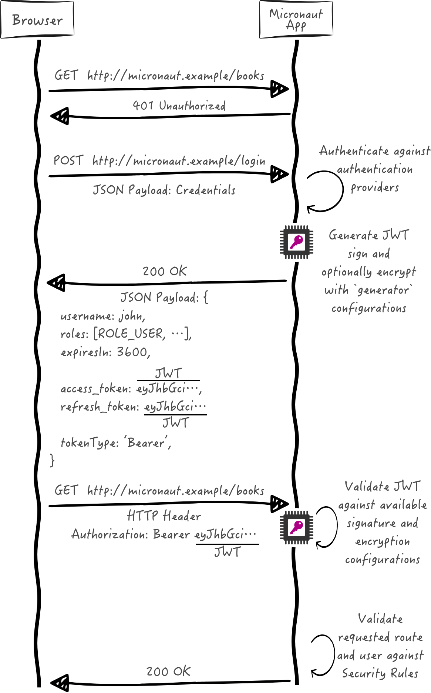

**08-05-25**

# Micronaut JWT Authentication





``` bash
mn create-app example.micronaut.micronautguide \
    --features=security-jwt,data-jdbc,reactor,validation,graalvm \
    --build=maven \
    --lang=java \
    --test=junit
```

## Configuração do JWT

``` bash

micronaut.security.authentication=bearer

micronaut.security.token.jwt.signatures.secret.generator.secret="${JWT_GENERATOR_SIGNATURE_SECRET:pleaseChangeThisSecretForANewOne}"'
```

## Autentication provider


``` java
package example.micronaut;

import io.micronaut.core.annotation.NonNull;
import io.micronaut.core.annotation.Nullable;
import io.micronaut.http.HttpRequest;
import io.micronaut.security.authentication.AuthenticationFailureReason;
import io.micronaut.security.authentication.AuthenticationRequest;
import io.micronaut.security.authentication.AuthenticationResponse;
import io.micronaut.security.authentication.provider.HttpRequestAuthenticationProvider;
import jakarta.inject.Singleton;

@Singleton
class AuthenticationProviderUserPassword<B> implements HttpRequestAuthenticationProvider<B> {

    @Override
    public AuthenticationResponse authenticate(
            @Nullable HttpRequest<B> httpRequest,
            @NonNull AuthenticationRequest<String, String> authenticationRequest
    ) {
        return authenticationRequest.getIdentity().equals("sherlock") && authenticationRequest.getSecret().equals("password")
                ? AuthenticationResponse.success(authenticationRequest.getIdentity())
                : AuthenticationResponse.failure(AuthenticationFailureReason.CREDENTIALS_DO_NOT_MATCH);
    }
}
```

## Controlador

``` java

package example.micronaut;

import io.micronaut.http.MediaType;
import io.micronaut.http.annotation.Controller;
import io.micronaut.http.annotation.Get;
import io.micronaut.http.annotation.Produces;
import io.micronaut.security.annotation.Secured;
import io.micronaut.security.rules.SecurityRule;

import java.security.Principal;

@Secured(SecurityRule.IS_AUTHENTICATED)
@Controller
public class HomeController {

    @Produces(MediaType.TEXT_PLAIN)
    @Get
    public String index(Principal principal) {
        return principal.getName();
    }
}
```


## Teste

``` java
package example.micronaut;

import com.nimbusds.jwt.JWTParser;
import com.nimbusds.jwt.SignedJWT;
import io.micronaut.http.HttpRequest;
import io.micronaut.http.HttpResponse;
import io.micronaut.http.client.HttpClient;
import io.micronaut.http.client.annotation.Client;
import io.micronaut.http.client.exceptions.HttpClientResponseException;
import io.micronaut.security.authentication.UsernamePasswordCredentials;
import io.micronaut.security.token.render.BearerAccessRefreshToken;
import io.micronaut.test.extensions.junit5.annotation.MicronautTest;
import jakarta.inject.Inject;
import org.junit.jupiter.api.Test;

import java.text.ParseException;

import static io.micronaut.http.HttpStatus.OK;
import static io.micronaut.http.HttpStatus.UNAUTHORIZED;
import static io.micronaut.http.MediaType.TEXT_PLAIN;
import static org.junit.jupiter.api.Assertions.assertEquals;
import static org.junit.jupiter.api.Assertions.assertNotNull;
import static org.junit.jupiter.api.Assertions.assertThrows;
import static org.junit.jupiter.api.Assertions.assertTrue;

@MicronautTest
class JwtAuthenticationTest {

    @Inject
    @Client("/")
    HttpClient client;

    @Test
    void accessingASecuredUrlWithoutAuthenticatingReturnsUnauthorized() {
        HttpClientResponseException e = assertThrows(HttpClientResponseException.class, () -> {
            client.toBlocking().exchange(HttpRequest.GET("/").accept(TEXT_PLAIN));
        });

        assertEquals(UNAUTHORIZED, e.getStatus());
    }

    @Test
    void uponSuccessfulAuthenticationAJsonWebTokenIsIssuedToTheUser() throws ParseException {
        UsernamePasswordCredentials creds = new UsernamePasswordCredentials("sherlock", "password");
        HttpRequest<?> request = HttpRequest.POST("/login", creds);
        HttpResponse<BearerAccessRefreshToken> rsp = client.toBlocking().exchange(request, BearerAccessRefreshToken.class);
        assertEquals(OK, rsp.getStatus());

        BearerAccessRefreshToken bearerAccessRefreshToken = rsp.body();
        assertEquals("sherlock", bearerAccessRefreshToken.getUsername());
        assertNotNull(bearerAccessRefreshToken.getAccessToken());
        assertTrue(JWTParser.parse(bearerAccessRefreshToken.getAccessToken()) instanceof SignedJWT);

        String accessToken = bearerAccessRefreshToken.getAccessToken();
        HttpRequest<?> requestWithAuthorization = HttpRequest.GET("/")
                .accept(TEXT_PLAIN)
                .bearerAuth(accessToken);
        HttpResponse<String> response = client.toBlocking().exchange(requestWithAuthorization, String.class);

        assertEquals(OK, rsp.getStatus());
        assertEquals("sherlock", response.body());
    }
}
```

## Usando o micronaut HTTP client

``` java
package example.micronaut;

import io.micronaut.http.annotation.Body;
import io.micronaut.http.annotation.Consumes;
import io.micronaut.http.annotation.Get;
import io.micronaut.http.annotation.Header;
import io.micronaut.http.annotation.Post;
import io.micronaut.http.client.annotation.Client;
import io.micronaut.security.authentication.UsernamePasswordCredentials;
import io.micronaut.security.token.render.BearerAccessRefreshToken;

import static io.micronaut.http.HttpHeaders.AUTHORIZATION;
import static io.micronaut.http.MediaType.TEXT_PLAIN;

@Client("/")
public interface AppClient {

    @Post("/login")
    BearerAccessRefreshToken login(@Body UsernamePasswordCredentials credentials);

    @Consumes(TEXT_PLAIN)
    @Get
    String home(@Header(AUTHORIZATION) String authorization);
}

```


``` java
package example.micronaut;

import com.nimbusds.jwt.JWTParser;
import com.nimbusds.jwt.SignedJWT;
import io.micronaut.security.authentication.UsernamePasswordCredentials;
import io.micronaut.security.token.render.BearerAccessRefreshToken;
import io.micronaut.test.extensions.junit5.annotation.MicronautTest;
import jakarta.inject.Inject;
import org.junit.jupiter.api.Test;

import java.text.ParseException;

import static org.junit.jupiter.api.Assertions.assertEquals;
import static org.junit.jupiter.api.Assertions.assertNotNull;
import static org.junit.jupiter.api.Assertions.assertTrue;

@MicronautTest
class DeclarativeHttpClientWithJwtTest {

    @Inject
    AppClient appClient;

    @Test
    void verifyJwtAuthenticationWorksWithDeclarativeClient() throws ParseException {
        UsernamePasswordCredentials creds = new UsernamePasswordCredentials("sherlock", "password");
        BearerAccessRefreshToken loginRsp = appClient.login(creds);

        assertNotNull(loginRsp);
        assertNotNull(loginRsp.getAccessToken());
        assertTrue(JWTParser.parse(loginRsp.getAccessToken()) instanceof SignedJWT);

        String msg = appClient.home("Bearer " + loginRsp.getAccessToken());
        assertEquals("sherlock", msg);
    }
}
```

## Issuing Refresh Tokens

``` properties

micronaut.security.token.jwt.generator.refresh-token.secret="${JWT_GENERATOR_SIGNATURE_SECRET:pleaseChangeThisSecretForANewOne}"'
```

Para gerar um token de atualização, sua aplicação deve ter beans dos tipos: RefreshTokenGenerator , RefreshTokenValidator e RefreshTokenPersistence . Trataremos deste último na próxima seção. Para o gerador e o validador, a Micronaut Security vem com SignedRefreshTokenGenerator . Ele cria e verifica um objeto codificado em JWS (assinatura web JSON) cujo payload é um UUID com um código de autenticação de mensagens baseado em hash (HMAC). Você precisa fornecer um segredo para usar, SignedRefreshTokenGeneratorque implementa ambos RefreshTokenGeneratore RefreshTokenValidator.

``` java
package example.micronaut;

import com.nimbusds.jwt.JWTParser;
import com.nimbusds.jwt.SignedJWT;
import io.micronaut.http.HttpRequest;
import io.micronaut.http.client.HttpClient;
import io.micronaut.http.client.annotation.Client;
import io.micronaut.security.authentication.UsernamePasswordCredentials;
import io.micronaut.security.token.render.BearerAccessRefreshToken;
import io.micronaut.test.extensions.junit5.annotation.MicronautTest;
import jakarta.inject.Inject;
import org.junit.jupiter.api.Test;

import java.text.ParseException;

import static org.junit.jupiter.api.Assertions.assertEquals;
import static org.junit.jupiter.api.Assertions.assertNotNull;
import static org.junit.jupiter.api.Assertions.assertTrue;

@MicronautTest
public class LoginIncludesRefreshTokenTest {

    @Inject
    @Client("/")
    HttpClient client;

    @Test
    void uponSuccessfulAuthenticationUserGetsAccessTokenAndRefreshToken() throws ParseException {
        UsernamePasswordCredentials creds = new UsernamePasswordCredentials("sherlock", "password");
        HttpRequest<?> request = HttpRequest.POST("/login", creds);
        BearerAccessRefreshToken rsp = client.toBlocking().retrieve(request, BearerAccessRefreshToken.class);

        assertEquals("sherlock", rsp.getUsername());
        assertNotNull(rsp.getAccessToken());
        assertNotNull(rsp.getRefreshToken());

        assertTrue(JWTParser.parse(rsp.getAccessToken()) instanceof SignedJWT);
    }
}
```


## Salvar o token de atualização

``` xml
<!-- Add the following to your annotationProcessorPaths element -->
<path>
    <groupId>io.micronaut</groupId>
    <artifactId>micronaut-data-processor</artifactId>
</path>
<dependency>
    <groupId>io.micronaut.data</groupId>
    <artifactId>micronaut-data-jdbc</artifactId>
    <scope>compile</scope>
</dependency>
<dependency>
    <groupId>io.micronaut.sql</groupId>
    <artifactId>micronaut-jdbc-hikari</artifactId>
    <scope>compile</scope>
</dependency>
<dependency>
    <groupId>com.h2database</groupId>
    <artifactId>h2</artifactId>
    <scope>runtime</scope>
</dependency>

```


``` java

package example.micronaut;
*/

import io.micronaut.core.annotation.NonNull;
import io.micronaut.data.annotation.DateCreated;
import io.micronaut.data.annotation.GeneratedValue;
import io.micronaut.data.annotation.Id;
import io.micronaut.data.annotation.MappedEntity;

import jakarta.validation.constraints.NotBlank;
import jakarta.validation.constraints.NotNull;
import java.time.Instant;

@MappedEntity
public class RefreshTokenEntity {

    @Id
    @GeneratedValue
    @NonNull
    private Long id;

    @NonNull
    @NotBlank
    private String username;

    @NonNull
    @NotBlank
    private String refreshToken;

    @NonNull
    @NotNull
    private Boolean revoked;

    @DateCreated
    @NonNull
    @NotNull
    private Instant dateCreated;

    public RefreshTokenEntity() {
    }

    // getters and setters...

    @NonNull
    public Long getId() {
        return id;
    }

    public void setId(@NonNull Long id) {
        this.id = id;
    }

    @NonNull
    public String getUsername() {
        return username;
    }

    public void setUsername(@NonNull String username) {
        this.username = username;
    }

    @NonNull
    public String getRefreshToken() {
        return refreshToken;
    }

    public void setRefreshToken(@NonNull String refreshToken) {
        this.refreshToken = refreshToken;
    }

    @NonNull
    public Boolean getRevoked() {
        return revoked;
    }

    public void setRevoked(@NonNull Boolean revoked) {
        this.revoked = revoked;
    }

    @NonNull
    public Instant getDateCreated() {
        return dateCreated;
    }

    public void setDateCreated(@NonNull Instant dateCreated) {
        this.dateCreated = dateCreated;
    }
}

```


``` java
package example.micronaut;

import io.micronaut.core.annotation.NonNull;
import io.micronaut.data.jdbc.annotation.JdbcRepository;
import io.micronaut.data.repository.CrudRepository;

import jakarta.transaction.Transactional;
import jakarta.validation.constraints.NotBlank;
import jakarta.validation.constraints.NotNull;
import java.util.Optional;

import static io.micronaut.data.model.query.builder.sql.Dialect.H2;

@JdbcRepository(dialect = H2)
public interface RefreshTokenRepository extends CrudRepository<RefreshTokenEntity, Long> {

    @Transactional
    RefreshTokenEntity save(@NonNull @NotBlank String username,
                            @NonNull @NotBlank String refreshToken,
                            @NonNull @NotNull Boolean revoked);

    Optional<RefreshTokenEntity> findByRefreshToken(@NonNull @NotBlank String refreshToken);

    long updateByUsername(@NonNull @NotBlank String username,
                          boolean revoked);
}

```

## Refresh Controller

``` java

package example.micronaut;

import io.micronaut.security.authentication.Authentication;
import io.micronaut.security.errors.OauthErrorResponseException;
import io.micronaut.security.token.event.RefreshTokenGeneratedEvent;
import io.micronaut.security.token.refresh.RefreshTokenPersistence;
import jakarta.inject.Singleton;
import org.reactivestreams.Publisher;
import reactor.core.publisher.Flux;
import reactor.core.publisher.FluxSink;

import java.util.Optional;

import static io.micronaut.security.errors.IssuingAnAccessTokenErrorCode.INVALID_GRANT;

@Singleton // <1>
public class CustomRefreshTokenPersistence implements RefreshTokenPersistence {

    private final RefreshTokenRepository refreshTokenRepository;

    public CustomRefreshTokenPersistence(RefreshTokenRepository refreshTokenRepository) {// <2>
        this.refreshTokenRepository = refreshTokenRepository;
    }

    @Override
    public void persistToken(RefreshTokenGeneratedEvent event) { // <3>
        if (event != null &&
                event.getRefreshToken() != null &&
                event.getAuthentication() != null &&
                event.getAuthentication().getName() != null) {
            String payload = event.getRefreshToken();
            refreshTokenRepository.save(event.getAuthentication().getName(), payload, false); // <4>
        }
    }

    @Override
    public Publisher<Authentication> getAuthentication(String refreshToken) {
        return Flux.create(emitter -> {
            Optional<RefreshTokenEntity> tokenOpt = refreshTokenRepository.findByRefreshToken(refreshToken);
            if (tokenOpt.isPresent()) {
                RefreshTokenEntity token = tokenOpt.get();
                if (token.getRevoked()) {
                    emitter.error(new OauthErrorResponseException(INVALID_GRANT, "refresh token revoked", null)); // <5>
                } else {
                    emitter.next(Authentication.build(token.getUsername())); // <6>
                    emitter.complete();
                }
            } else {
                emitter.error(new OauthErrorResponseException(INVALID_GRANT, "refresh token not found", null)); // <7>
            }
        }, FluxSink.OverflowStrategy.ERROR);
    }
}

```


1. Use jakarta.inject.Singleton para designar uma classe como singleton.
2. Injeção de construtor de RefreshTokenRepository.
3. Quando um novo token de atualização é emitido, o aplicativo emite um evento do tipo RefreshTokenGeneratedEvent . Nós o monitoramos e salvamos o token no banco de dados.
4. O evento contém o token de atualização e os detalhes do usuário associados ao token.
5. Lance uma exceção se o token for revogado.
6. Retorna os detalhes do usuário associados ao token de atualização, por exemplo, nome de usuário, funções, atributos, etc.
7. Lance uma exceção se o token não for encontrado.

## Teste

``` java
package example.micronaut;

import io.micronaut.core.type.Argument;
import io.micronaut.http.HttpRequest;
import io.micronaut.http.client.HttpClient;
import io.micronaut.http.client.annotation.Client;
import io.micronaut.http.client.exceptions.HttpClientResponseException;
import io.micronaut.security.endpoints.TokenRefreshRequest;
import io.micronaut.security.token.render.BearerAccessRefreshToken;
import io.micronaut.test.extensions.junit5.annotation.MicronautTest;
import jakarta.inject.Inject;
import org.junit.jupiter.api.Test;

import java.util.Map;
import java.util.Optional;

import static io.micronaut.http.HttpStatus.BAD_REQUEST;
import static org.junit.jupiter.api.Assertions.assertEquals;
import static org.junit.jupiter.api.Assertions.assertThrows;
import static org.junit.jupiter.api.Assertions.assertTrue;

@MicronautTest
class UnsignedRefreshTokenTest {

    @Inject
    @Client("/")
    HttpClient client;

    @Test
    void accessingSecuredURLWithoutAuthenticatingReturnsUnauthorized() {

        String unsignedRefreshedToken = "foo"; // <1>

        Argument<BearerAccessRefreshToken> bodyArgument = Argument.of(BearerAccessRefreshToken.class);
        Argument<Map> errorArgument = Argument.of(Map.class);

        HttpClientResponseException e = assertThrows(HttpClientResponseException.class, () -> {
            client.toBlocking().exchange(
                    HttpRequest.POST("/oauth/access_token", new TokenRefreshRequest(TokenRefreshRequest.GRANT_TYPE_REFRESH_TOKEN, unsignedRefreshedToken)),
                    bodyArgument,
                    errorArgument);
        });
        assertEquals(BAD_REQUEST, e.getStatus());

        Optional<Map> mapOptional = e.getResponse().getBody(Map.class);
        assertTrue(mapOptional.isPresent());

        Map m = mapOptional.get();
        assertEquals("invalid_grant", m.get("error"));
        assertEquals("Refresh token is invalid", m.get("error_description"));
    }
}
```
Use um token não assinado

``` java
package example.micronaut;

import io.micronaut.core.type.Argument;
import io.micronaut.http.HttpRequest;
import io.micronaut.http.client.HttpClient;
import io.micronaut.http.client.annotation.Client;
import io.micronaut.http.client.exceptions.HttpClientResponseException;
import io.micronaut.security.authentication.Authentication;
import io.micronaut.security.token.generator.RefreshTokenGenerator;
import io.micronaut.security.endpoints.TokenRefreshRequest;
import io.micronaut.security.token.render.BearerAccessRefreshToken;
import io.micronaut.test.extensions.junit5.annotation.MicronautTest;
import jakarta.inject.Inject;
import org.junit.jupiter.api.Test;

import java.util.Map;
import java.util.Optional;

import static io.micronaut.http.HttpStatus.BAD_REQUEST;
import static org.junit.jupiter.api.Assertions.assertEquals;
import static org.junit.jupiter.api.Assertions.assertThrows;
import static org.junit.jupiter.api.Assertions.assertTrue;

@MicronautTest
class RefreshTokenNotFoundTest {

    @Inject
    @Client("/")
    HttpClient client;

    @Inject
    RefreshTokenGenerator refreshTokenGenerator;

    @Test
    void accessingSecuredURLWithoutAuthenticatingReturnsUnauthorized() {
        Authentication user = Authentication.build("sherlock");

        String refreshToken = refreshTokenGenerator.createKey(user);
        Optional<String> refreshTokenOptional = refreshTokenGenerator.generate(user, refreshToken);
        assertTrue(refreshTokenOptional.isPresent());

        String signedRefreshToken = refreshTokenOptional.get();
        Argument<BearerAccessRefreshToken> bodyArgument = Argument.of(BearerAccessRefreshToken.class);
        Argument<Map> errorArgument = Argument.of(Map.class);
        HttpRequest<?> req = HttpRequest.POST("/oauth/access_token", new TokenRefreshRequest(TokenRefreshRequest.GRANT_TYPE_REFRESH_TOKEN, signedRefreshToken));

        HttpClientResponseException e = assertThrows(HttpClientResponseException.class, () -> {
            client.toBlocking().exchange(req, bodyArgument, errorArgument);
        });
        assertEquals(BAD_REQUEST, e.getStatus());

        Optional<Map> mapOptional = e.getResponse().getBody(Map.class);
        assertTrue(mapOptional.isPresent());

        Map m = mapOptional.get();
        assertEquals("invalid_grant", m.get("error"));
        assertEquals("refresh token not found", m.get("error_description"));
    }
}
```

1. Forneça um token assinado que nunca foi salvo.


``` java
package example.micronaut;

import io.micronaut.context.ApplicationContext;
import io.micronaut.core.type.Argument;
import io.micronaut.http.HttpRequest;
import io.micronaut.http.client.HttpClient;
import io.micronaut.http.client.exceptions.HttpClientResponseException;
import io.micronaut.runtime.server.EmbeddedServer;
import io.micronaut.security.authentication.Authentication;
import io.micronaut.security.token.generator.RefreshTokenGenerator;
import io.micronaut.security.endpoints.TokenRefreshRequest;
import io.micronaut.security.token.render.BearerAccessRefreshToken;
import org.junit.jupiter.api.Test;

import java.util.Collections;
import java.util.Map;
import java.util.Optional;

import static io.micronaut.http.HttpStatus.BAD_REQUEST;
import static org.junit.jupiter.api.Assertions.assertEquals;
import static org.junit.jupiter.api.Assertions.assertThrows;
import static org.junit.jupiter.api.Assertions.assertTrue;

class RefreshTokenRevokedTest {

    EmbeddedServer embeddedServer = ApplicationContext.run(EmbeddedServer.class, Collections.emptyMap());
    HttpClient client = embeddedServer.getApplicationContext().createBean(HttpClient.class, embeddedServer.getURL());
    RefreshTokenGenerator refreshTokenGenerator = embeddedServer.getApplicationContext().getBean(RefreshTokenGenerator.class);
    RefreshTokenRepository refreshTokenRepository = embeddedServer.getApplicationContext().getBean(RefreshTokenRepository.class);

    @Test
    void accessingSecuredURLWithoutAuthenticatingReturnsUnauthorized() {
        Authentication user = Authentication.build("sherlock");

        String refreshToken = refreshTokenGenerator.createKey(user);
        Optional<String> refreshTokenOptional = refreshTokenGenerator.generate(user, refreshToken);
        assertTrue(refreshTokenOptional.isPresent());

        long oldTokenCount = refreshTokenRepository.count();
        String signedRefreshToken = refreshTokenOptional.get();
        refreshTokenRepository.save(user.getName(), refreshToken, true); // <1>
        assertEquals(oldTokenCount + 1, refreshTokenRepository.count());

        Argument<BearerAccessRefreshToken> bodyArgument = Argument.of(BearerAccessRefreshToken.class);
        Argument<Map> errorArgument = Argument.of(Map.class);
        HttpClientResponseException e = assertThrows(HttpClientResponseException.class, () -> {
            client.toBlocking().exchange(
                    HttpRequest.POST("/oauth/access_token", new TokenRefreshRequest(TokenRefreshRequest.GRANT_TYPE_REFRESH_TOKEN, signedRefreshToken)),
                    bodyArgument,
                    errorArgument);
        });
        assertEquals(BAD_REQUEST, e.getStatus());

        Optional<Map> mapOptional = e.getResponse().getBody(Map.class);
        assertTrue(mapOptional.isPresent());

        Map m = mapOptional.get();
        assertEquals("invalid_grant", m.get("error"));
        assertEquals("refresh token revoked", m.get("error_description"));

        refreshTokenRepository.deleteAll();
    }
}
```
1. 	Salve o token, mas marque-o como revogado


``` java
package example.micronaut;

import io.micronaut.http.HttpRequest;
import io.micronaut.http.client.HttpClient;
import io.micronaut.http.client.annotation.Client;
import io.micronaut.security.authentication.UsernamePasswordCredentials;
import io.micronaut.security.endpoints.TokenRefreshRequest;
import io.micronaut.security.token.render.AccessRefreshToken;
import io.micronaut.security.token.render.BearerAccessRefreshToken;
import io.micronaut.test.extensions.junit5.annotation.MicronautTest;
import jakarta.inject.Inject;
import org.junit.jupiter.api.Test;

import static org.junit.jupiter.api.Assertions.assertEquals;
import static org.junit.jupiter.api.Assertions.assertNotEquals;
import static org.junit.jupiter.api.Assertions.assertNotNull;

@MicronautTest(rollback = false)
class OauthAccessTokenTest {

    @Inject
    @Client("/")
    HttpClient client;

    @Inject
    RefreshTokenRepository refreshTokenRepository;

    @Test
    void verifyJWTAccessTokenRefreshWorks() throws InterruptedException {
        String username = "sherlock";

        UsernamePasswordCredentials creds = new UsernamePasswordCredentials(username, "password");
        HttpRequest<?> request = HttpRequest.POST("/login", creds);

        long oldTokenCount = refreshTokenRepository.count();
        BearerAccessRefreshToken rsp = client.toBlocking().retrieve(request, BearerAccessRefreshToken.class);
        Thread.sleep(3_000);
        assertEquals(oldTokenCount + 1, refreshTokenRepository.count());

        assertNotNull(rsp.getAccessToken());
        assertNotNull(rsp.getRefreshToken());

        Thread.sleep(1_000); // sleep for one second to give time for the issued at `iat` Claim to change
        AccessRefreshToken refreshResponse = client.toBlocking().retrieve(HttpRequest.POST("/oauth/access_token",
                new TokenRefreshRequest(TokenRefreshRequest.GRANT_TYPE_REFRESH_TOKEN, rsp.getRefreshToken())), AccessRefreshToken.class); // <1>

        assertNotNull(refreshResponse.getAccessToken());
        assertNotEquals(rsp.getAccessToken(), refreshResponse.getAccessToken());

        refreshTokenRepository.deleteAll();
    }
}
```

1. Faça uma solicitação POST /oauth/access_token com o token de atualização no payload JSON para obter um novo token de acesso
2. Um token de acesso diferente é recuperado.
